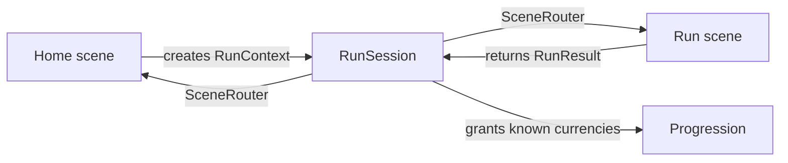

# RunContext and RunResult contract

Milestone 5 separates the foundation from one particular game loop. A
participant's home decides when to begin a run, the run owns its genre-specific
rules, and `RunSession` commits permanent rewards exactly once after completion.



## Start a run

In the home scene, create a `RunContext` with a stable `run_id`, the run scene
path, the home return path, and any calculated start values. Then store it in
the transient session before changing scenes:

```gdscript
var context := RunContext.new(
    &"mine_run",
    "res://game/mine_run.tscn",
    "res://game/home.tscn",
    "Mine Run",
    {&"move_speed": Progression.get_effective_stat(&"run_speed", 72.0)},
)
if RunSession.begin_run(context) == OK:
    SceneRouter.change_to(context.run_scene_path)
```

The run reads `RunSession.get_active_context()`. Treat it as input: use
`starting_values` for calculated permanent effects and `payload` for values
specific to this genre, map, or character. There are no mid-run saves in this
foundation, so a fresh context intentionally replaces an abandoned one.

## Finish or abandon a run

The run chooses its own completion rule. When that rule succeeds, return a
result with only persistent progression currencies in `rewards`:

```gdscript
var result := RunResult.new(
    context.run_id,
    true,
    {&"gold": 12, &"insight": 1},
    "+12 Gold, +1 Insight",
    {&"depth_reached": 4},
)
if RunSession.complete_run(result) == OK:
    SceneRouter.change_to(context.return_scene_path)
```

`RunSession` rejects mismatched run IDs, empty IDs, non-positive rewards, and
currency IDs absent from the progression catalog. A completed result grants its
validated rewards through `Progression`, becomes the session's latest result,
and clears the active context. The home can display
`RunSession.get_last_result().summary` after it loads.

For an intentional failure or quit route, either call
`RunSession.abandon_active_run()` or complete a result with `completed` set to
`false` and an empty rewards dictionary. Incomplete results never change the
permanent wallet.

## Replace the starter safely

`game/starter_home.tscn` and `game/starter_run.tscn` are a small working
reference. Rename or replace them along with the constants in
`game/starter_game.gd`; keep the same context/result exchange. The demo is not
part of this route. Run `tests/demo_removal_smoke.ps1` after removing `demo/`
to verify that the app and starter game still load without it.
